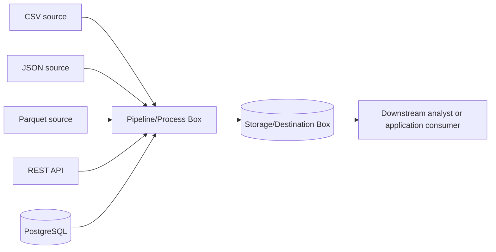

# Data Lifecycle Map

| Lifecycle Element | What It Means | Example in This Lab | Primary Tool/Artifact | Possible Failure |
| :--- | :--- | :--- | :--- | :--- |
| **Source system** | Where the raw data originally comes before anything is altered or edited. | CSV, JSON, Parquet, REST API | Web servers, local file systems, external APIs | downed REST API, missing source file |
| **Ingestion/acquisition** | fetching data into environment | downloading files | pythin (requests library) | network connection timed out, permission denied |
| **Storage** | where data is kept | store data in local database | postgresql, docker | database container fails to start, lack of disk space |
| **Processing/transformation** | cleaning, filtering data into something usable | structure raw data into proper rows and columns | python (pandas) | data type errors |
| **Data quality/validation** | checking data and system to ensure both are correct and working | test scripts | python (verify_environment.py, sqlalchemy) | failed database authentication |
| **Delivery** | make final data accessible to end-users | querying database to pull out information | sql, sqlalchemy | queries take long to run, wrong results |
| **Consumer** | the person or system that uses the data | a downstream analyst | dashboards, apps | consumer misunderstands data, bugs and crashes |

